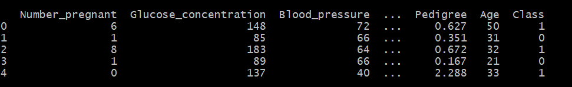
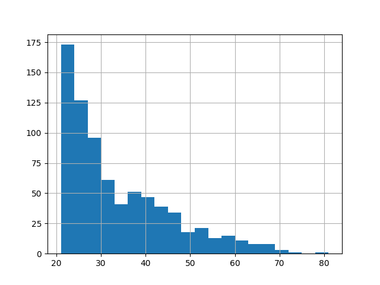

# Simplilearn – Intro To AI


[Video Link](https://www.youtube.com/watch?v=FWOZmmIUqHg)

### What is it?
AI is a branch of computer science dedicated to creating intelligent machines that work and react like humans.

### Types of AI
-	Reactive machines – don’t have memories, or past experiences. Specific Jobs
-	Limited Memory – Use past experience and present data to make decisions 
	- _E.g. Self driving cars_
-	Theory of Mind – Can Socialise and understand human emotions
    - _yet to be built_
-	Self Awareness – Superintelligent, sentient and concious

### Achieving AI
-	Machine Learning
-	Deep Learning
	-	Input layer, hidden layer, Output layer
	-	Uses old data to predict new data

### Applications of AI
-	Google Home

## Predicting risk of diabetes
#### Prerequisites
- The code used to create the model, and predict other patients risk is in the main.py file.
- [Miniconda](https://docs.conda.io/en/latest/miniconda.html) was downloaded to make use of the [virtual environments](https://docs.conda.io/projects/conda/en/4.6.0/_downloads/52a95608c49671267e40c689e0bc00ca/conda-cheatsheet.pdf), and packages available, as we will be needing tensorflow, sklearn and more.
- Note that Tensorflow only works with python versions up to 3.8
- The ```tf.estimator.inputs``` function seen in main.py is depreciated and only works with versions of tensorflow before 2. I used the ```tf.compat.v1.estimator.inputs``` to get around this bug.

#### main.py
- First step was to import all the packages we will be needing in this programme.
```python
import pandas as pd
import tensorflow as tf
import matplotlib.pyplot as plt
from sklearn.model_selection import train_test_split
```
- Load data into pandas object, and print first 5 rows to double check the data was converted correctly
```py
diabetes = pd.read_csv('pima-indians-diabetes.csv')
print(diabetes.head())
```

- The float values in the table need to be normalised so they are comparable to one another.
```py
cols_to_norm = ['Number_pregnant', 'Glucose_concentration', 'Blood_pressure', 'Triceps', 'Insulin', 'BMI', 'Pedigree']
diabetes[cols_to_norm] = diabetes[cols_to_norm].apply(lambda x: (x - x.min()) / (x.max() - x.min()))
```
- Map the columns in tensorflow format
```py
num_preg = tf.feature_column.numeric_column('Number_pregnant')
Gluc_conc = tf.feature_column.numeric_column('Glucose_concentration')
bld_press = tf.feature_column.numeric_column('Blood_pressure')
tricep = tf.feature_column.numeric_column('Triceps')
insulin = tf.feature_column.numeric_column('Insulin')
bmi = tf.feature_column.numeric_column('BMI')
pedigree = tf.feature_column.numeric_column('Pedigree')
age = tf.feature_column.numeric_column('Age')
```
- We can plot a histogram of the ages of the participents in the data to see the distribution
```py
diabetes['Age'].hist(bins=20)
plt.show()
```
- Which should show this graph

- So we can put age into buckets so its easier to work with
```py
age_buckets = tf.feature_column.bucketized_column(age, boundaries=[20,30,40,50,60,80])
```
- Create a list of the columns that will feature. we will use this later.
```py
feat_cols = [num_preg, Gluc_conc, bld_press, tricep, insulin, bmi, pedigree, age_buckets]
```
- Drop the Class from the x_data as that is the actual risk of diabetes
- Create a train/test split of the data
- Create the input function you will train
```py
x_data = diabetes.drop('Class', axis=1)
labels = diabetes['Class']
X_train, X_test, y_train, y_test = train_test_split(x_data, labels, test_size=0.35, random_state=101)

input_func = tf.compat.v1.estimator.inputs.pandas_input_fn(x=X_train, y=y_train, batch_size=10, num_epochs=1000, shuffle=True)
```
- Finally we can train the model. We have chosen to go over the function 500 times.
```py
model = tf.estimator.LinearClassifier(feature_columns=feat_cols, n_classes=2)
model.train(input_fn=input_func, steps=500)
```
- Now can use model to predict chance of diabetes for 10 of the patients
```py
pred_input_func = tf.compat.v1.estimator.inputs.pandas_input_fn( x=X_test, batch_size=10, num_epochs=1, shuffle=False)
predictions = model.predict(pred_input_func)
list(predictions)
```
- Compare the 10 peoples predicted results with their actual results so we can see the accuracy of the model.
```py
eval_input_func = tf.compat.v1.estimator.inputs.pandas_input_fn(x=X_test, y=y_test, batch_size=10, num_epochs=1, shuffle=False)
results = model.evaluate(eval_input_func)
print(results)
```
- It should show a list like this
```bash
{'accuracy': 0.732342, 'accuracy_baseline': 0.65799254, 'auc': 0.77189267, 'auc_precision_recall': 0.61932063, 'average_loss': 0.54399353, 'label/mean': 0.34200743, 'loss': 0.5440154, 'precision': 0.6219512, 'prediction/mean': 0.37419087, 'recall': 0.5543478, 'global_step': 500}
```
- Showing the accuracy to be approximately **0.7**